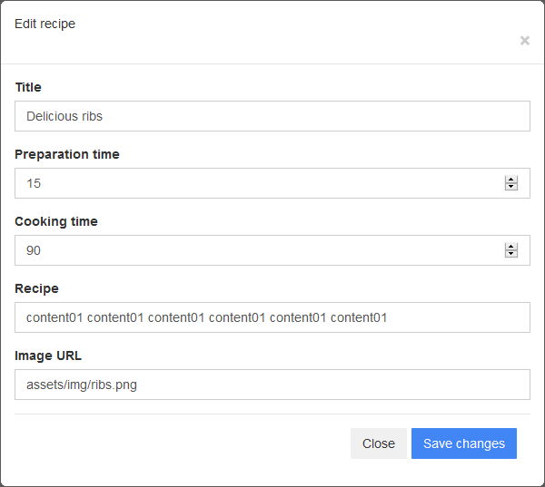

[![Issues][issues-shield]][issues-url]
[![LinkedIn][linkedin-shield]][linkedin-url]

<!-- PROJECT LOGO -->
 

  

  <h3 align="center">COOKBOOK</h3>

  

     README CookBook project 
     
    <a href="https://github.com/m-wrobel91/cookbook"><strong>Explore the docs »</strong></a>
     
         <a href="https://github.com/m-wrobel91/cookbook/issues">Report Bug</a>
    ·
    <a href="https://github.com/m-wrobel91/cookbook/issues">Request Feature</a>  ·
    <a href="https://github.com/m-wrobel91/cookbookGUI">Front-End Docs</a>
  

  
  

  
  

<!-- TABLE OF CONTENTS -->

  
Table of Contents

  <ol>
    <li>
      <a href="#about-the-project">About the Project</a>
      <ul>
        <li><a href="#uml-class-diagram">UML class diagram</a></li>
        <li><a href="#built-with">Built with</a></li>
        <li><a href="#more-to-go">More to go</a></li>
      </ul>
    </li>
    <li><a href="#contact">Contact</a></li>
    <li><a href="#acknowledgements">Acknowledgements</a></li>
  </ol>

<!-- ABOUT THE PROJECT -->
## About The Project
  
 Application is a simple cookbook that allows adding new recipes, update and delete existing ones. User also will be able look for the specific recipe using search option - *functionality under construction*. While adding or updating the entry the data inserted is validated - on the frontend. User also might look for the specific recipe while clicking *'Show more'* button. Recipes might be evaluated in range *1-5*. Each of the recipies contains number of votes and average rating.
 
In future the user will be able to login and to add the comment under the recipe. 
 
For front-end code go to: <a href="https://github.com/m-wrobel91/cookbookGUI">Front-End Docs</a>

  <figure>
    
     
    
Fig.1 - Screenshot from the application with the Angular frontend.

    </figure>

This project was created in order to learn more on java web applications and acquire good programming habits. Great attention was paid on clean code rules while writing the code. Domain-driven-design principles were followed while building the application. Each of the domain layer has its own role in the application. CookBook is backed by H2 database. For retrieving and saving data to database JPA Repository was used. For testing the backend API endpoints 'Swagger' was used.
 
Project was developed to get acquainted with basics of Angular. Front end is made on the base of Bootstrap templates. 

  <figure>
    
     
    
Fig.2 - Screenshot of modal used to add recipe.

    </figure>

  <figure>
    
     
    
Fig.3 - Screenshot of modal used to display more information referring to the recipe with its comments.

    </figure>

  <figure>
    
     
    
Fig.4 - Screenshot of modal used to edit the recipe.

    </figure>

  <figure>
    
     
    
Fig.5 - Screenshot of modal used to confirm the deletion of the recipe.

    </figure>

Endpoints:  
**Recipe entity**
> **POST** /recipe/add  · *addRecipe* 
> **GET** /recipe/all  · *getAllRecipes* 
> **DELETE** /recipe/delete/{id}  · *deleteRecipe* 
> **GET** /recipe/find/{id}  · *getRecipeById* 
> **PUT** /recipe/rate  · *rateRecipe*
 

**Comment entity**
>**POST** /comment/add  · *addComment* 
>**GET** /comment/find/{id}  · *getRecipeById* 
>*more to be added*

### UML class diagram
Find below UML class diagram for the application:

-UML DIAGRAM UNDER CONSTRUCTION-

### Built With

Below find  major frameworks that was used to build project. 
* [Spring Boot](https://spring.io/projects/spring-boot)
* [Spring](https://spring.io/)
* [Spring Web MVC](https://docs.spring.io/spring-framework/docs/3.2.x/spring-framework-reference/html/mvc.html)
* [Spring Data JPA](https://docs.spring.io/spring-data/jpa/docs/current/reference/html/#reference)
* [H2 database](https://www.h2database.com/)
* [Maven](https://maven.apache.org/)
* [Swagger](https://swagger.io/)
* [Angular](https://angular.io/)
* [Bootstrap](https://getbootstrap.com/)

### More to go
There is number of functionalities that might be added to the application such as:
- logging, 
- authorization that might allow for number of users, and commenting under the recipes,
- adding and edditing comments for the recipe.

<!-- CONTACT -->
## Contact

Michał Wróbel 
- [Github page](https://github.com/m-wrobel91)
- [Portfolio page](https://m-wrobel91.github.io/)
- [Linkedin page](https://www.linkedin.com/in/micha%C5%82-wr%C3%B3bel-85055012a/)

<!-- ACKNOWLEDGEMENTS -->
## Acknowledgements

* [Bootdey](https://www.bootdey.com/)
* [Font Awesome](https://fontawesome.com)

<!-- MARKDOWN LINKS & IMAGES -->

[issues-shield]: https://img.shields.io/github/issues/m-wrobel91/journal-app.svg?style=for-the-badge
[issues-url]: https://github.com/m-wrobel91/Best-README-Template/issues

[linkedin-shield]: https://img.shields.io/badge/-LinkedIn-black.svg?style=for-the-badge&logo=linkedin&colorB=555
[linkedin-url]: https://www.linkedin.com/in/micha%C5%82-wr%C3%B3bel-85055012a/
[github-url]: https://github.com/m-wrobel91
[app-logo]: images/book-solid.svg
